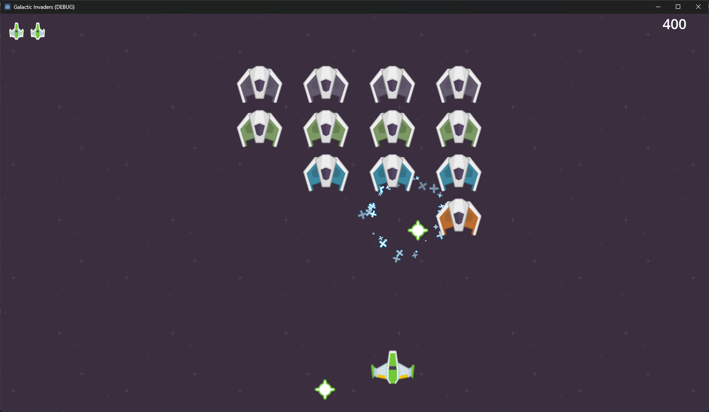

# godot-kenney-examples
A few example Godot projects made with the Kenney assets. I've tried to make these well-commented and polished enough to work as good starting points for people to make their own games.

## Galactic Invaders

A standard, simple, single-scene Space Invaders clone using the Kenney Space Shooter Redux and Sci-Fi Sounds asset packs. Provides good examples of using character bodies, signals, timers, particle effects, sound effects, autoload singletons, and a few other common features, as well as a template for organising your project.
